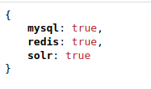

.. include:: ../Includes.txt

.. _introduction:

============
Introduction
============

What does it do?
================

Add a route to check if all services are up.

The page with ?type=1607616696 will return a json with the state of different services needed by the website.

Screenshots
===========

An example of return of the route

